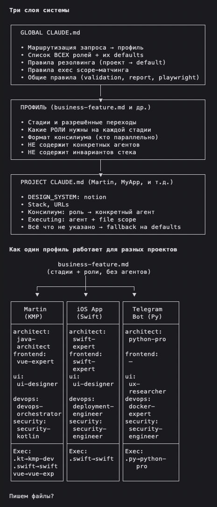
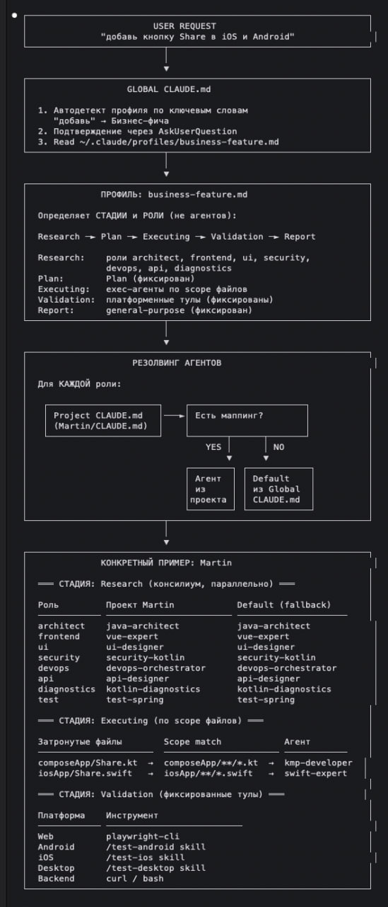

# Harnest

AI coding assistant configurator. Detects your project stack, runs an interactive agent wizard, and generates configs for Claude Code, Cursor, and Windsurf.

## About

Every AI coding tool needs project context. Manually maintaining `CLAUDE.md`, `.cursorrules`, `.windsurfrules` is tedious — especially for multi-stack projects where wrong agents get assigned.

Harnest detects your stack, suggests agents, and lets you pick:

```bash
$ harnest init

Detected stack:
  - spring-boot (kotlin) [backend/]
  - compose-multiplatform (kotlin) [composeApp/]
  - ios-native (swift) [iosApp/]
  - vue (typescript) [vue-frontend/]

── Agent Wizard ──
Enter = accept suggestion, s = skip, or type agent name

[Consilium: architect]
  Suggestion: voltagent-lang:java-architect
  Enter agent (Enter=suggestion, s=skip): my-custom-architect

[Exec: spring-boot → backend/**/*.kt]
  Suggestion: builder-spring-feature
  Enter agent (Enter=suggestion, s=skip):

Generated: CLAUDE.md
  Consilium roles: 6
  Exec agents: 4
```

## Install

**1. Get the binary**

```bash
brew tap AlexGladkov/tap
brew install harnest
```

Or with Go:

```bash
go install github.com/AlexGladkov/harnest/cmd/harnest@latest
```

Or download from [Releases](https://github.com/AlexGladkov/harnest/releases).

**2. Install the framework**

```bash
harnest install
```

Installs 6 workflow profiles and global CLAUDE.md framework to `~/.claude/`. Uses `<!-- harnest-managed -->` markers — your custom content is preserved on updates.

## Scenarios

### Generate project config (interactive)

```bash
cd my-project
harnest init
```

Detects stack → select harness (Claude Code / Cursor / Windsurf) → agent wizard for each role and exec scope → generates config file.

### Generate for a specific harness

```bash
harnest init --harness cursor
```

### CI / scripts (no wizard)

```bash
harnest init --non-interactive
```

Uses suggested agents automatically. Defaults to Claude Code harness.

### Detect stack without generating

```bash
harnest detect
```

### View / override agent mappings

```bash
harnest agents list
harnest agents set architect my-architect-agent
```

### Convert between harnesses

```bash
harnest convert --from claude-code --to cursor
```

### Manage profiles individually

```bash
harnest profiles list
harnest profiles add business-feature
harnest profiles remove research
```

## Package

### What `harnest install` sets up

**6 workflow profiles** → `~/.claude/profiles/`

| Profile | Stages |
|---------|--------|
| business-feature | Research → Plan → Executing → Validation → Report |
| bug-hunting | Reproduce → Diagnose → Fix → Validation → Report |
| research | Consilium investigation, no code changes |
| refactoring | Audit → Plan → Executing → Regression check |
| e2e-testing | Prepare → Deploy → Run → Fix → Re-run → Report |
| e2e-authoring | Research → Propose → Approve → Save scenarios |

**Global CLAUDE.md** → `~/.claude/CLAUDE.md`

Profile routing (auto-detect by keywords), role definitions, agent resolution rules, validation rules (playwright, mobile MCP), reporting format.

### Architecture

Three-layer system. One profile works for any project — agents differ per project, stages stay the same.





### 8 consilium roles

| Role | Purpose |
|------|---------|
| architect | Architecture, modules, dependencies, SOLID |
| frontend | UI/UX review, frontend patterns |
| ui | Visual design, UX, components |
| security | OWASP, vulnerabilities, auth |
| devops | Infrastructure, CI/CD, deployment |
| api | API contracts, REST/GraphQL |
| diagnostics | Logs, stacktraces, debugging |
| test | Test coverage, quality |

### Stack detection

| Indicator | Detected Stack |
|-----------|---------------|
| `build.gradle.kts` + spring | Spring Boot (Kotlin) |
| `composeApp/` | Compose Multiplatform |
| `iosApp/` or `Package.swift` | iOS / Swift |
| `package.json` + vue | Vue.js |
| `package.json` + react | React |
| `package.json` + next | Next.js |
| `angular.json` | Angular |
| `package.json` + express/fastify/nestjs | Node.js |
| `pubspec.yaml` | Flutter |
| `go.mod` | Go |
| `Cargo.toml` | Rust |
| `pyproject.toml` + fastapi | FastAPI |
| `pyproject.toml` + django | Django |
| `pyproject.toml` + flask | Flask |

### Harness output formats

| Harness | Output File | Features |
|---------|------------|----------|
| Claude Code | `CLAUDE.md` | Full consilium + exec scope + profiles |
| Cursor | `.cursorrules` | Expert roles + file ownership |
| Windsurf | `.windsurfrules` | Stack context + code areas |

## License

This software is licensed under [CC BY-NC 4.0](LICENSE) — free for non-commercial use.
For commercial licensing, contact the author.
